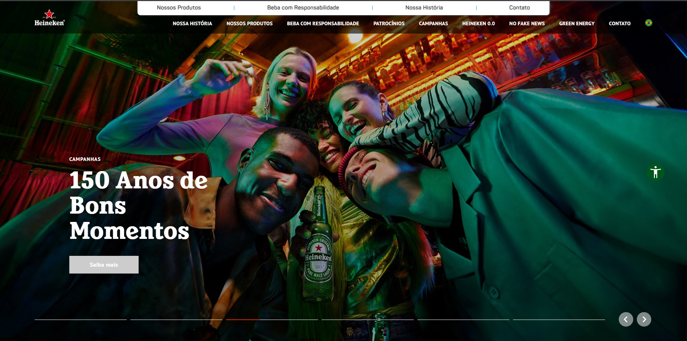

# Projeto de Testes para o Site da Heineken Brasil

Este repositório documenta um conjunto de testes exploratórios realizados no site da **Heineken Brasil**. O objetivo principal foi validar o correto funcionamento de funcionalidades críticas do site, incluindo a verificação de idade e outras operações.

## Detalhes do Teste

### Testes de Verificação de Idade e Outras Funcionalidades

- **Verificação de Data Futura:** Testei a inserção de datas de nascimento no futuro para garantir que o sistema rejeitasse entradas que não fazem sentido para a verificação de idade.
- **Datas Impossíveis e Formatos Inválidos:** Realizei testes com datas inexistentes, como "31/02/2000", e variações de formato de data (ex: "02 31 2000") para assegurar que o sistema validasse corretamente a entrada.
- **Outras Funcionalidades do Site:** Explorei áreas além da verificação de idade para identificar possíveis problemas de usabilidade, acessibilidade e desempenho, garantindo que as funcionalidades do site estivessem alinhadas às expectativas de experiência do usuário.

### Exemplo de Casos de Teste

- **Validação de Acesso por Idade:** O sistema deve exibir uma mensagem de erro ao inserir uma data que indique menoridade ou não seja válida.
- **Usabilidade e Acessibilidade em Funcionalidades Gerais:** O sistema deve ser responsivo e acessível, com mensagens claras para entradas incorretas e feedback visual adequado em todos os dispositivos.
- **Desempenho e Navegação:** O site deve carregar rapidamente e manter a navegação fluida entre as seções, sem erros ou atrasos.

## Conclusão

Este projeto de testes no site da Heineken Brasil abrange a verificação de idade e outras funcionalidades essenciais para conferir se o sistema funciona conforme o esperado. Os testes verificam a validação de entrada, usabilidade e experiência do usuário,
